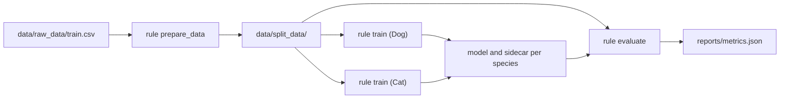

| **Authors** | **Project** | **Build Status** | **Coverage** |
|:-----------:|:-----------:|:----------------:|:------------:|
| [**C. Pollastro**](https://github.com/chiarapollastro01) | **shelter-animal-outcomes** | [](https://github.com/chiarapollastro01/shelter_animal_outcomes/actions/workflows/ci.yml) | **100%** |

[](https://github.com/chiarapollastro01/shelter_animal_outcomes/pulls)
[](https://github.com/chiarapollastro01/shelter_animal_outcomes/issues)
[](https://github.com/chiarapollastro01/shelter_animal_outcomes/stargazers)
[](https://github.com/chiarapollastro01/shelter_animal_outcomes/watchers)

# shelter-animal-outcomes v0.1.0

### Multi-class classification of shelter animal outcomes 

Multi-class classification task regarding the Austin Animal Center dataset: the goal is to predict what happens to an animal leaving the shelter. The project covers the whole path from the raw Kaggle file to a scored model: exploratory analysis, feature engineering, per-species model selection, and an evaluation report, wired together as a reproducible Snakemake workflow.

* [Overview](#overview)
* [Method](#method)
* [Prerequisites](#prerequisites)
* [Installation](#installation)
* [Usage](#usage)
* [Testing](#testing)
* [Table of contents](#table-of-contents)
* [Contribution](#contribution)
* [Authors](#authors)
* [License](#license)
* [Citation](#citation)

## Overview

Each row of the dataset is one animal leaving the shelter, described by what was known about it on arrival: species, breed, colour, sex and reproductive status, age, whether it had a name, and the timestamp of the outcome. The target is the outcome itself, one of five classes: `Adoption`, `Transfer`, `Return_to_owner`, `Euthanasia` and `Died`.
Dogs and cats get **two independent models**. The exploratory phase
([`reports/eda.md`](./reports/eda.md)) showed that the two populations behave differently enough that pooling them would hide the difference rather than exploit it. 

> [!NOTE]
> The raw data file is **not versioned**. See [Prerequisites](#prerequisites)
> for how to obtain it and how to verify that you have the same copy the
> reported figures were produced from.

## Method

This section states the statistical reasoning behind the choices the code makes. Every claim here corresponds to something the pipeline actually does; the
measured consequences are in [`reports/results.md`](./reports/results.md).

### The problem is imbalanced, and that governs everything

The five outcomes are far from equally frequent. `Adoption` covers about 40% of the dataset and `Died` about 0.7%. Three
consequences follow, and each one dictates a design decision.

**Accuracy is not a usable objective.** Standard accuracy only measures the raw percentage of correct guesses. A naive model that always predicts the majority class scores 0.417 on dogs and 0.494 on cats without learning anything. Selection is therefore driven by **macro-averaged F1**, representing the outcome-averaged balance between false alarms and missed cases. The unweighted mean of the per-class F1 scores gives `Died` exactly the same weight as `Adoption`. Reporting adds **balanced accuracy**, the mean of the per-class recalls, for the same reason.

**Every split must be stratified.**  In *k*-fold cross-validation, the training dataset is split into multiple equal subsets, training on *k-1* folds and evaluating on the remaining one in rotation to ensure the model generalizes reliably. Splitting data just once risks picking an unusually easy or hard validation partition, leading to hyperparameters that overfit to that specific split. Furthermore, in a dataset with so few minority examples, a uniform random split can easily hand a fold a class distribution unlike the population's, or none of a rare class at all. Both the train/test split and the cross-validation folds preserve the class proportions, using `train_test_split(stratify=y)` and `StratifiedKFold`.

**The rare classes need help during training.** Rather than duplicating identical rows (which causes overfitting), the pipeline applies
SMOTE, which creates synthetic minority examples by interpolating between a minority point and one of its *k* nearest minority neighbours. `k_neighbors` is itself a tuned hyperparameter, because how far the interpolation reaches is a modelling choice and not a constant of nature. 

### Resampling belongs inside the pipeline, not before it

Applying data cleaning or oversampling before splitting the data causes data leakage, an artificial error where information from future test/validation folds bleeds into the training set. If a synthetic row is generated before cross-validation, it can blend a training point with a validation point, allowing the model to "cheat" by evaluating on data it has already seen. In this project SMOTE is a **step of the estimator**, so during `GridSearchCV` all statistics and synthetic rows are learned and generated exclusively on the training folds. The held-out validation fold remains entirely untouched during the learning phase.

### Every choice is a hyperparameter, and they are searched together

Hyperparameters for data preprocessing (`max_other_ratio` for rare category binning and `k_neighbors` for SMOTE interpolation) are tuned simultaneously with classifier parameters (`n_estimators`, `C`). Tuning them in separate stages would incorrectly assume that the best data representation is independent of the model consuming it; searching them jointly finds the best combination in the grid. Randomized search is ideal for large, continuous search spaces, but here the grid is deliberately small, discrete, and domain-informed. This choice provides a trade-off between an exhaustive search and computational cost.

### Encoding choices follow from the distributions

The derivation and exploratory motivation for each feature are documented in [`reports/eda.md`](./reports/eda.md). After filling the missing values, different approaches are used for the engineering of the features: periodic temporal quantities are mapped onto the unit circle as a sine and cosine pair,

$$x_{\sin} = \sin\!\left(\frac{2\pi t}{T}\right), \qquad x_{\cos} = \cos\!\left(\frac{2\pi t}{T}\right)$$

with $T$ equal to 24, 7 or 365, so that hour 23 stays adjacent to hour 0 instead of being the farthest point in the column.
Age is compressed with `log1p` rather than a plain logarithm, since the latter is undefined at zero, which is exactly where newborn animals sit.
High-cardinality attributes `Breed` and `Color` are first reduced to their primary form and then dynamically binned by frequency. Three binary indicators are extracted explicitly: reproductive status, a weekend flag, and a breed-cross flag. Categorical attributes are one-hot encoded to best represent discrete levels, numeric features are normalized to the $[0, 1]$ range via min-max scaling, preventing scale disparities which would bias distance-based estimators, and boolean flags are simply passed through the pipeline. 

### Model selection, and the optimism that comes with it

Three families compete per species: K-nearest neighbours, multinomial logistic regression and random forest, each over its own grid combined with the shared preprocessing grid, for 90 configurations and 450 fits per species. The winner is the configuration with the best mean cross-validated macro-F1.

Taking the maximum over 90 estimates is itself optimistic: the winner is partly selected on the noise of its own validation score. To measure that optimism, a **hold-out set is isolated per species before the search begins** and the winner is scored on it once. The gap between the cross-validation F1-macro and the holdout F1-macro is very small, as shown in [reports/results.md](./reports/results.md),  which is the evidence that the tuning did not overfit the
folds.

> [!NOTE]
> Two grid points can be separated by less than the noise. An earlier run of the
> same code on a slightly different set of library versions crowned a 100-tree
> forest where the current one crowns 200 trees, on a difference in the fourth
> decimal. Not every winning hyperparameter value is a result; the exact
> environment behind the reported figures is frozen in `requirements-lock.txt`.

### What is finally saved

Once the configuration is chosen, it is refit on **all** of the species data, hold-out included, and that artefact is what gets persisted and evaluated. The hold-out has served its purpose by then, and the extra rows are worth more in the final model than a score that no longer has to be estimated. The scores reported on the test set therefore come from a model that no cross-validation figure describes.

## Prerequisites

Python 3.10 or later. The lower bound comes from the `X | None` syntax used
throughout the type hints.

The complete list of requirements is declared in
[`pyproject.toml`](./pyproject.toml), with a lower bound at the version the project was developed against and an upper bound excluding the next major, so that a future release cannot silently change the results. The exact versions behind the reported tables are pinned in
[`requirements-lock.txt`](./requirements-lock.txt).

The raw data file is not versioned. Download `train.csv` from the
[Shelter Animal Outcomes](https://www.kaggle.com/c/shelter-animal-outcomes) competition and place it at `data/raw_data/train.csv`.
[`data/metadata/`](./data/metadata/) documents where the file comes from, what its columns mean and what is missing from them, and carries the checksum of the copy this analysis was run on:

```bash
sha256sum -c data/metadata/checksums.txt
```

## Installation


```bash
python -m venv .venv
source .venv/bin/activate
pip install -e ".[dev]"
```

To reproduce the figures in [`reports/results.md`](./reports/results.md) exactly, install the frozen environment instead of the declared ranges:

```bash
pip install -r requirements-lock.txt
```

## Usage

The whole workflow is one command:

```bash
snakemake --cores all
```



Everything is rebuilt only when its inputs are newer, so a second run with nothing changed does nothing. Useful variations:

```bash
snakemake --cores all -n                    # show what would run, without running it
snakemake --cores all --forceall            # rebuild everything from scratch
snakemake --cores all --detailed-summary    # provenance of every output
```

### About the cores

`--cores` bounds how many Snakemake jobs run at once, but the two tournaments are declared with `threads: workflow.cores`, so they run one after the other.
That is deliberate: `GridSearchCV` inside each of them already uses `n_jobs=-1`, and overlapping the two would have them compete for the same CPUs. The parallelism that pays here is in the search, not between the species.

### Command line interface

Every module is a command-line program, and the Snakefile calls those programs through `shell:`. Each can be run on its own during development:

```bash
python -m src.prepare_data data/raw_data/train.csv --output-dir data/split_data
python -m src.train --species Dog
python -m src.evaluate
```

`python -m src.<module> --help` lists the options of each.

### The exploratory analysis

[`src/eda.py`](./src/eda.py) is not part of the Snakefile: it produces figures that no later step consumes, and rebuilding them on every change of the raw file would cost time for nothing. Run it when you want them:

```bash
python -m src.eda data/raw_data/train.csv --figures-dir reports/figures
```

## Testing

```bash
pytest
mypy src/ tests/
pylint src/ tests/
```
The same three commands run on every push and pull request through
[GitHub Actions](./.github/workflows/ci.yml).

`pytest` collects both `tests/` and `src/`: the second because the docstring examples are run as part of the suite, so an example cannot drift away from the code it documents.

The suite is built in three cumulative layers. Unit tests cover each function on
its typical case and its edge cases, every one of them documented in
GIVEN / WHEN / THEN form. Doctests keep the documented examples honest. Property based tests, written with [`hypothesis`](https://hypothesis.readthedocs.io), check the statements the docstrings make across generated inputs rather than chosen ones, that any written age round-trips through the parser, and that the share of rows collapsed into `Other` respects its declared ceiling for any distribution of categories.

Coverage is at 100%.

## Table of contents

Only the versioned directories are listed here; the full layout, generated directories included, is below.

| Directory | Description |
| --- | --- |
| [`src`](./src/) | The package: configuration, preprocessing, feature engineering, pipeline, training, evaluation and EDA. |
| [`tests`](./tests/) | The test suite, one module per source module. |
| [`data/metadata`](./data/metadata/) | Provenance, dataset card and checksum of the raw file. |
| [`reports`](./reports/) | The exploratory findings and the evaluation results. |
| [`.github/workflows`](./.github/workflows/) | The CI workflow, running the checks on every push. |

### Layout

```
README.md              this file
AUTHORS.md             who wrote this and in what context
.github/workflows/     the CI workflow
config.yaml            run parameters: split sizes, folds, metrics, 
                       search grids
Snakefile              the dependency graph of the three pipeline steps
pyproject.toml         package metadata, dependencies, tool 
                       configuration
requirements-lock.txt  lists all Python package dependencies and their
                       exact versions
LICENSE                MIT
.gitignore             what stays out of the repository
data/metadata/         provenance and checksum of the raw file
data/raw_data/         the Kaggle file (not versioned)
data/split_data/       train/test split (not versioned, rebuilt by the 
                       pipeline)
models/                fitted pipelines and their metadata (not 
                       versioned)
reports/eda.md         what the exploratory phase found
reports/results.md     what the trained models score, and what that 
                       means
reports/metrics.json   the scores the evaluation step writes (not
                       versioned, rebuilt by the pipeline)
reports/figures/       the EDA figures, embedded in eda.md
src/                   the package
tests/                 the test suite
```

### Inside `src/`

| Module | Responsibility |
| --- | --- |
| `config.py` | The dataset schema, the paths, and the loader of `config.yaml`. |
| `prepare_data.py` | Reads the raw file, separates the target, splits train and test. |
| `preprocessing.py` | Row filtering, age parsing into days, and the cleaning transformer for the pipeline. |
| `feature_engineering.py` | The transformers that derive the model's features. |
| `pipeline.py` | Assembles cleaning, features, encoding, oversampling and classifier into one estimator. |
| `train.py` | Runs the tournament for one species and persists the winner. |
| `evaluate.py` | Scores the trained models on the test split. |
| `eda.py` | The exploratory analysis and its figures. |

### Two configuration files

[`src/config.py`](./src/config.py) holds what describes the **data**: column names, feature groups, the paths where the datasets live. Changing any of it is a code change, so it sits next to the code.

[`config.yaml`](./config.yaml) holds what describes a **run**: the split
proportions, the number of folds, the scoring metrics, the metric the winner is refit on, and the hyperparameter search grids. Changing those is an analysis decision, so a different file can be handed to any step without a commit:

```bash
python -m src.train --config experiments/wide_grid.yaml --species Dog
```

### Generality

The dataset schema lives in one file: column names are read from
`src/config.py` and never spelled out in the modules; the transformers take them as constructor parameters, so renaming `AgeuponOutcome` means editing one line. Adding a species is a one-line change to `config.SPECIES` plus the addition of a colour of its own in `SPECIES_COLORS` (`src/eda.py`). The column side of this is asserted, not assumed:
`test_extractors_support_custom_column_names` runs every transformer against renamed columns, `TestDataCleanerCustomAndE2E` covers custom fill targets and dropped columns, and the training tests are parametrised over `config.SPECIES` rather than over `Dog` and `Cat`.
The generality has two further boundaries. The names of the columns the transformers *write* are fixed, e.g.  `DataCleaner` always produces `config.LOG_AGE_COL` whatever the input column was called, therefore renaming works on the way in, not on the way out. And adding a derived feature takes two steps, not one: the `ColumnTransformer` routes columns by name, so a new column that is not listed in `NUM_SCALE_COLS` or `CAT_ENCODE_COLS` reaches the classifier through
`remainder="passthrough"`, unscaled and unencoded, without raising anything.

## Contribution

Any contribution is more than welcome. Please open an issue or a pull request describing what you would change and why.

Code contributed to this project is expected to keep the suite green
(`pytest`), the type checker silent (`mypy`), and `pylint` at 10.00/10, and to document every public function with a numpydoc docstring whose examples run.

## Authors

* **Chiara Pollastro** ([github](https://github.com/chiarapollastro01)) 

## License

The `shelter-animal-outcomes` project is licensed under the MIT
[License](./LICENSE).


## Citation

If you have found this project helpful, please consider citing the repository:

```BibTeX
@misc{shelter-animal-outcomes,
  author = {Pollastro, Chiara},
  title = {shelter-animal-outcomes - Multi-class classification of shelter animal outcomes},
  year = {2026},
  publisher = {GitHub},
  howpublished = {\url{https://github.com/chiarapollastro01/shelter_animal_outcomes}}
}
```
