# Exploratory Data Analysis — Shelter Animal Outcomes

Exploratory Data Analysis (EDA) is the essential first step in the data
science pipeline. Its purpose is to uncover the underlying structure of the dataset, investigate variables, and diagnose data quality before applying any
predictive model: detecting missing values and outliers, and exploring the distributions of individual features through statistical plots is fundamental for good feature engineering.

All figures referenced below are generated by `src/eda.py`:

```bash
python -m src.eda data/raw_data/train.csv --figures-dir reports/figures
```

---

## Target Distribution

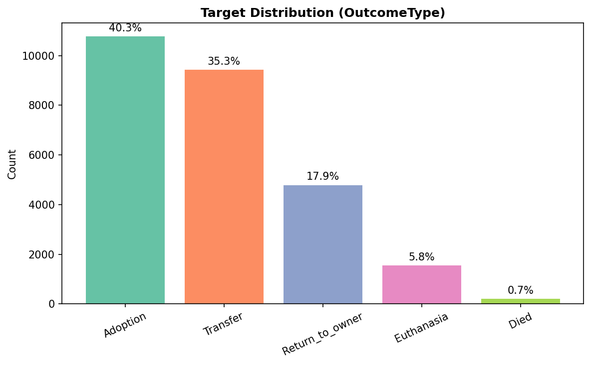

`OutcomeType` is the target of the classification task. The distribution is
not uniform: **Adoption (~40%)** and **Transfer (~35%)** dominate, while
Euthanasia (~6%) and Died (<1%) are heavily under-represented. The dataset, therefore,
was not obtained through stratified sampling: it reflects the real-world
outcome frequencies at the Austin Animal Center. This imbalance motivates
the use of stratified cross-validation, F1-macro as the selection metric,
and oversampling (SMOTE) inside the training pipeline.

## Missing Values

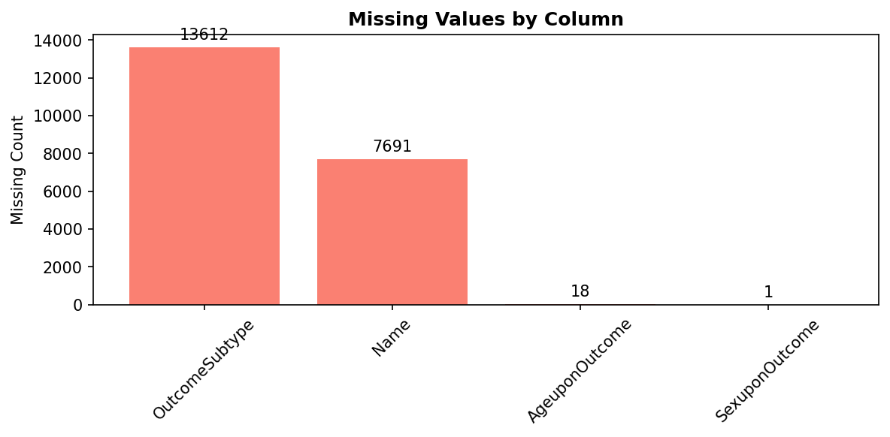

| Column | Missing | Strategy |
| --- | --- | --- |
| OutcomeSubtype | 13 612 (~51%) | **Dropped.** Could in principle be a secondary target, but with ~50% missing entries imputation is not appropriate; it also constitutes target leakage. |
| Name | 7 691 (~29%) | Imputed with `"Unknown"`. Unnamed animals are likely strays, which carries information and justifies the creation of the `has_name`column. |
| AgeuponOutcome | 18 | Imputed with the median age (fitted on train only). |
| SexuponOutcome | 1 | Imputed with the mode (fitted on train only). |
| Breed | 0 | **Preventive Imputation & Binning.** Imputed with `"Unknown"`. |
| Color | 0 | **Preventive Imputation & Binning.** Imputed with `"Unknown"`. |

**Note on High-Cardinality Categorical Features (`Breed` & `Color`):**
 Although `Breed` and `Color` contain no missing values in the training set, a preventive imputation strategy is embedded within the pipeline. Any potential missing entries or unseen rare categories present in test/production splits are automatically imputed with `"Unknown"` and merged into the catch-all `"Other"` category during frequency binning (`RareCategoriesGrouper`). This ensures pipeline robustness and prevents categorical encoding failures on unseen data.


## Species Split

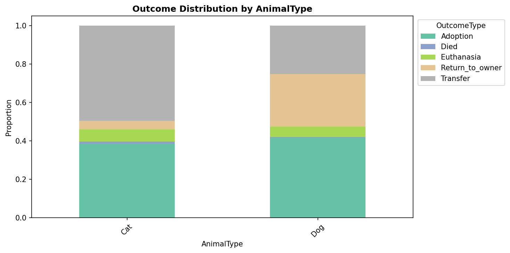

Looking at the dataset as a single aggregate is misleading: cats are
transferred in ~50% of cases while dogs are returned to their owner far more
often (28% vs 4%). For this reason the analysis
is split into two dedicated tracks, dogs and cats.

## Age

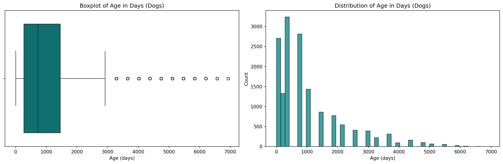
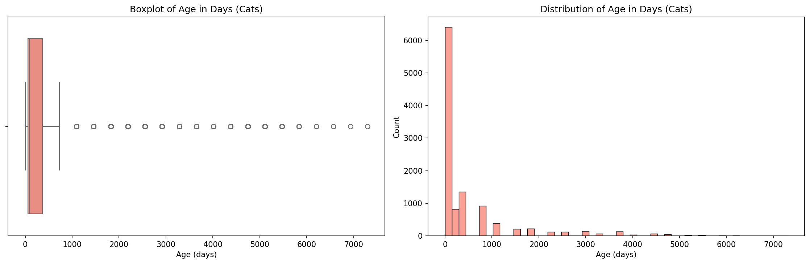

- **Dogs:** the median age is 730 days (~2 years), so there's a predominantly adult population.
- **Cats:** the median age drops to 90 days (~3 months), there's a massive volume of
  kitten intakes compared to adult cats.
- **Right-skewness:** both distributions are highly right-skewed. A
  `log(x+1)` transformation compresses the long tail toward a more Gaussian
  shape, which benefits distance-based and linear models.

## Breed and Color — High Cardinality

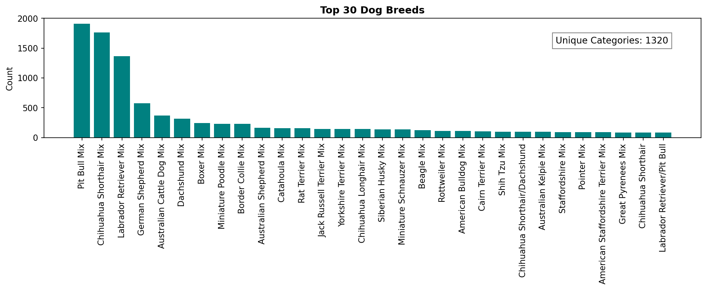
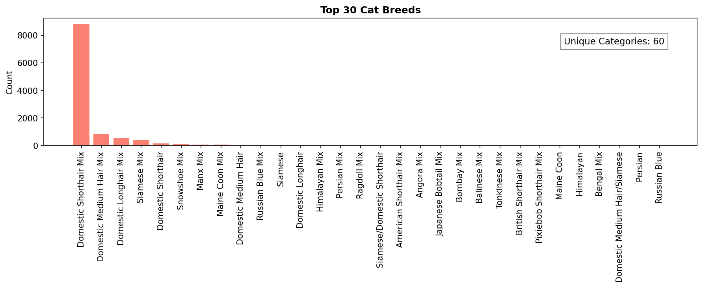
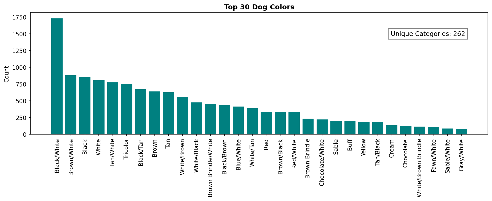
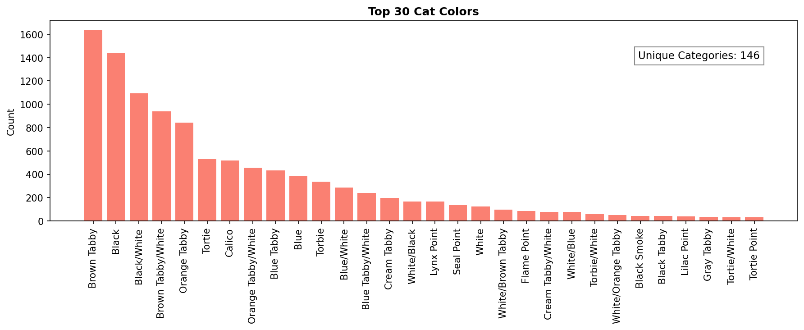

Both features show a significant high-cardinality problem: **1 320 unique
dog breeds** vs 60 cat breeds, and 262 vs 146 unique colors, with a sparse
long tail of combinations appearing only a handful of times. The adopted
strategy is (a) extracting the primary component (first breed/color before
the `/`, stripping the trailing `Mix` keyword) plus a binary `is_mix` flag,
and (b) dynamically binning infrequent categories into `Other` while
retaining a sufficient amount of information.


## Temporal Patterns

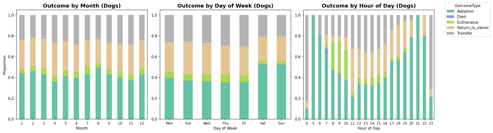
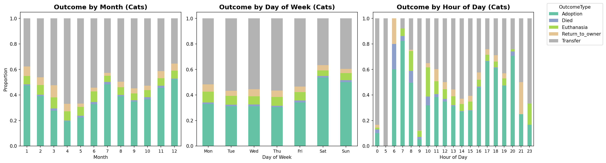

Outcome proportions vary with month, weekday and hour without exhibiting an interpretable real-world pattern, exception made for surge in adoptions during weekends. This motivates the cyclic sine/cosine encoding of hour,
weekday and day-of-year plus the `IsWeekend` flag used by
`TemporalFeaturesExtractor`. Cyclic encoding preserves the adjacency of
hour 23 and hour 0, which a plain integer encoding would break.

## Sex and Reproductive Status
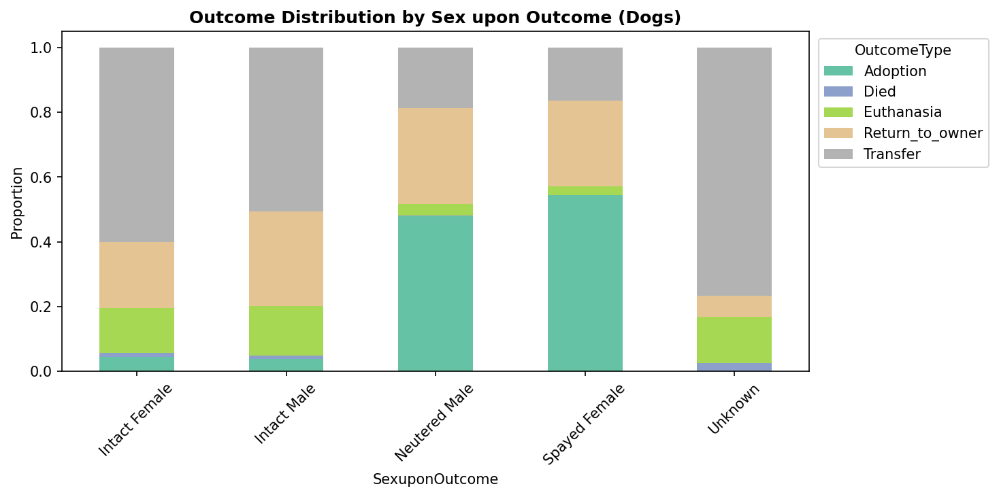
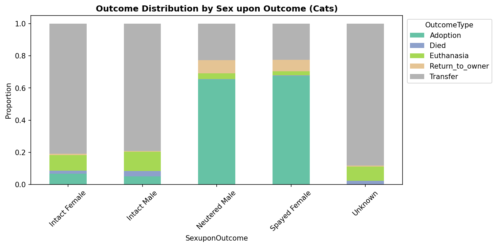

SexuponOutcome analysis reveals that outcome probabilities differ drastically based on whether the animal is sterilized (Neutered/Spayed) versus intact: sterilized animals show a significantly higher rate of adoption. Within the same reproductive state, the outcome distributions for Males and Females are virtually identical. This motivates the creation of the `Reproductive_Status` flag.

---

*This report is the frozen narrative of the exploratory phase. The
reusable logic lives in `src/eda.py` (tested in `tests/test_eda.py`); the
figures are regenerated on demand and are not committed.*
